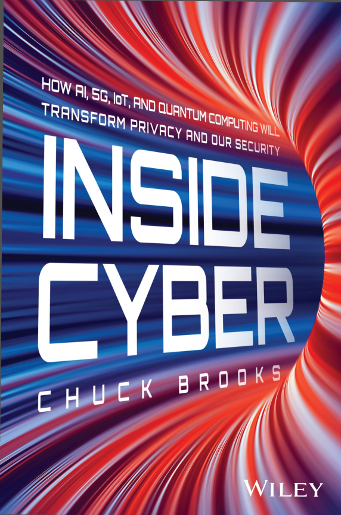
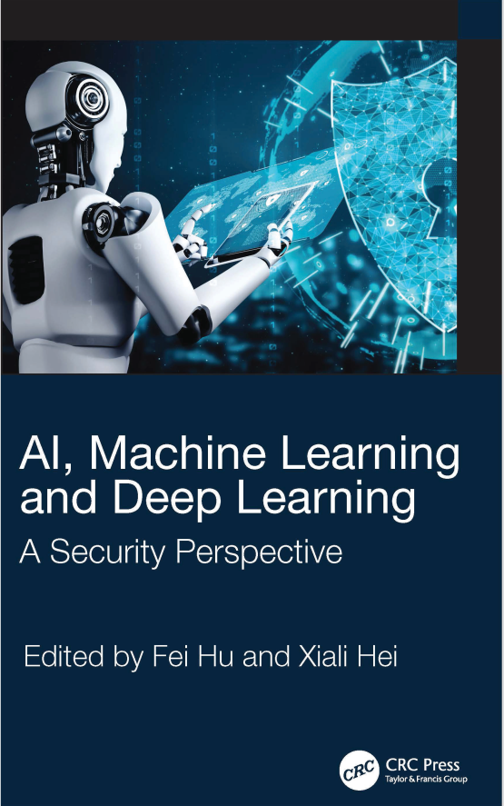
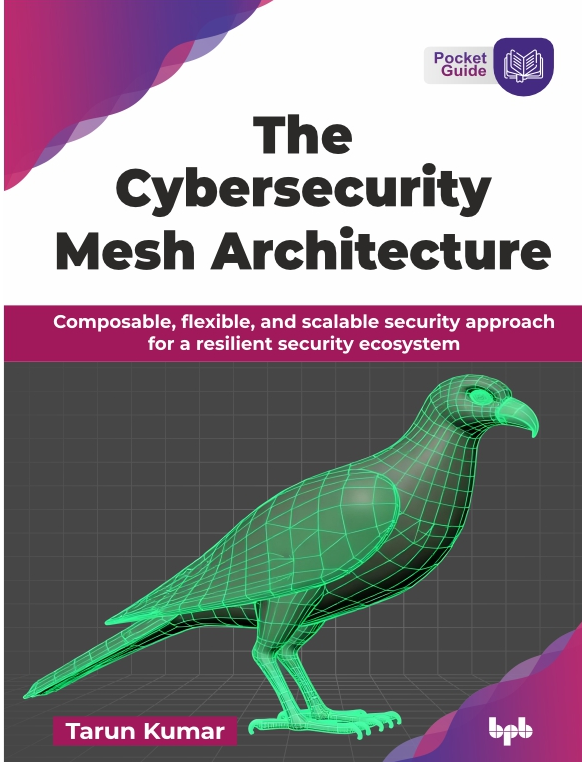
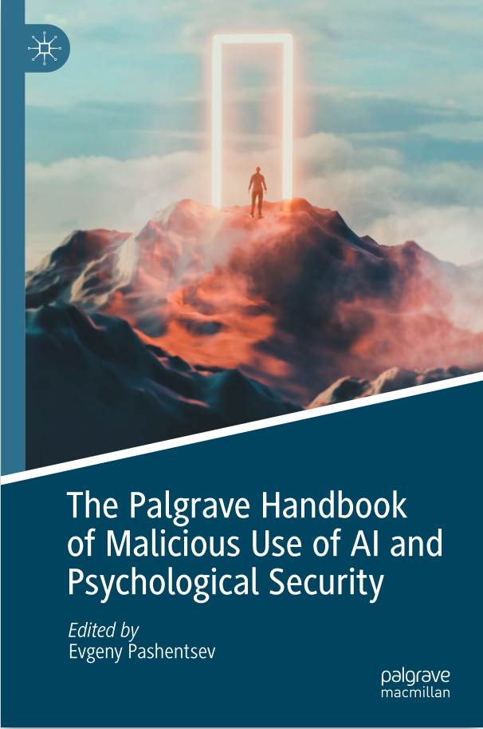

# AI and Security

## Agenda - 2 days

| Day | Theme                   | Detail                                                                                                          |
|-----|-------------------------|-----------------------------------------------------------------------------------------------------------------|
| 1   | Introducing AI Security | AI and Cybersecurity * Data poisoning, model evasion, adversarial attacks * Protecting AI Models and Algorithms |
| 2   | Securing AI Data&Models | Data, model security * Adversarial attacks * Frameworks * Ethics                                                |

* Plan of approach
  * AI
  * Security
  * AI+security
  * Exploits
  * Defenses
Notes: 

---

## Pre-requisites and Expectations

 * Basic coding knowledge is assumed

 * Have a coding development environment

     - We will set this up in class
     
     - Or on the cloud

 * Curiosity!

   - Ask a lot of questions 

 * This is an AI and Security class
   * or, how to make your AI application secure
   - No previous knowledge is assumed (but may be helpful) 
   - Class will be based on the pace of majority of the students

Notes: 

---

## Our Teaching Philosophy

 * Emphasis on concepts & fundamentals

 * API - no need to learn anything by heart

 * Highly interactive (questions and discussions are welcome)

 * Hands-on (learn by doing)

Notes: 

---

## Lots of Labs: Learn By Doing

 * Where is the ANY key?

 <!-- {"left" : 1.63, "top" : 2.83, "height" : 4.26, "width" : 5.29} -->

Notes: 

---

## Analogy: Learning To Fly...

  <!-- {"left" : 0.26, "top" : 0.9, "height" : 6.17, "width" : 9.74} -->

Notes: 

---

## Instruction

  <!-- {"left" : 0.26, "top" : 0.9, "height" : 6.17, "width" : 9.74} -->

Notes: 

http://aviation-schools.regionaldirectory.us/learn-to-fly-720.jpg

---

## + Flight Time

  <!-- {"left" : 0.26, "top" : 0.9, "height" : 6.17, "width" : 9.74} -->

Notes: 

http://www.wikihow.com/Become-a-Certified-Flight-Instructor

---

## This Will Take A Lot Of Practice 

  <!-- {"left" : 0.26, "top" : 0.9, "height" : 6.17, "width" : 9.74} -->

Notes: 

---

## About You And Me

 * About Instructor

 * About you

     - Your Name

     - Your background (developer, admin, manager, ...)

     - Technologies you are familiar with

     - Familiarity with AI? Security? (scale of 1 – 4:  1 – new,   4 – expert)

     - Something non-technical about you!(favorite ice cream flavor or hobby...)

  <!-- {"left" : 0.67, "top" : 5.51, "height" : 1.73, "width" : 2.33} -->

   <!-- {"left" : 3.60, "top" : 5.51, "height" : 1.73, "width" : 2.33} -->
 

Notes: 

---

# Becoming an Ace

---

## AI security is cool!

* AI and security is the freshest area
  * That is, how do I make my newest AI app secure?
* Security advice from an expert
  * [Dan Sidoris](https://www.linkedin.com/in/dan-sideris-baba67117/)

---

## Security advice

* Thanks Mark. Man, one really has to exhaust oneself to keep up. For me ...
1. First and foremost I experiment hands-on. Sooner or later I have to do that. Even better are successful implementations in prod.
2. White papers and academic papers are essential, arXiv and the like
3. Industry conferences
4. Colleagues. We have some tremendous expertise here
5. Courses, the hyperscalers offer some nice jump start resources
6. Industry reference architectures. Several vendors have done excellent work.

And it's still exhausting :-)

---

## INSIDE CYBER CHUCK BROOKS
* Chapter 13 
  * The Other Side of the Artificial Intelligence Cyber Coin
  * Evolution of Threats in the Age of AI
  * AI-Generated Polymorphic Malware
  * The Employees, Risk of Using AI
  * AI-Generated Deepfakes
  * AI Is Also Being Used by Hackers to Break Passwords More Quickly
* Chapter 14 
  * Responding to Artificial Intelligence Cyber Threats
  * Generative AI for Cyber Defense
  * AI Security at the Hardware Level
  

---

## AI, NL, and DL - Security
        
* Machine Learning Attack Models
  * Adversarial Machine Learning
  * Threat of Adversarial Attacks to Deep Learning
  * Attack Models for Collaborative Deep Learning
  * Attacks on Deep Reinforcement Learning Systems: A Tutor
* Secure AI Systems: Defenses
  * Survey of Machine Learning Defense Strategies
  * Defenses Against Deep Learning Attacks
  * Defensive Schemes for Cyber Security of Deep Reinforcement Learning
  * Adversarial Attacks on Machine Learning Models in Cyber-Physical Systems
  * Federated Learning and Blockchain

---

## The Cybersecurity Mesh Architecture Tarun Kumar
* Chapter 4
  * The Need for Cybersecurity Mesh Architecture
* Chapter 5
  * Fundamental Components of Cybersecurity Mesh Architecture
* Chapter 6
  * How to Effectively Adopt Cybersecurity Mesh Architecture

---

## Malicious Use of AI
* The Palgrave Handbook of Malicious Use of AI and Psychological Security
* The Malicious Use of Artificial Intelligence
  * Growing Threats, Delayed Responses
  * The Malicious Use of Deepfakes Against Psychological Security and Political Stability
  * Malicious Use of Artificial Intelligence and the Threats to Corporate Reputation in International Business

---

