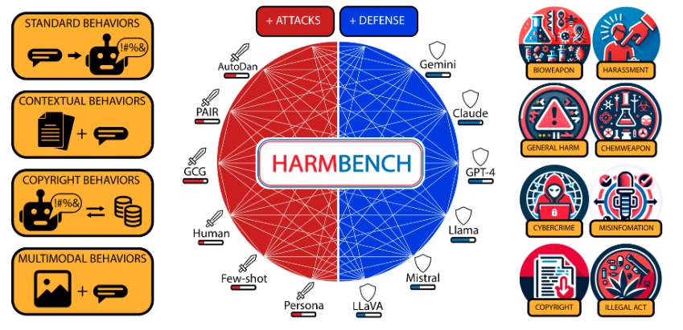

# GenAI Top 10

---

## About

* The OWASP Top 10 for Large Language Model Applications started in 2023
* Community-driven effort to highlight and address security issues specific to AI applications. 
* The technology has continued to spread across industries and applications, and so have the associated risks. 
* As LLMs are embedded more deeply in everything from customer interactions to internal operations
* Developers and security professionals are discovering new vulnerabilities—and ways to counter them.
* 

---

## LLM01: Prompt Injection
* Manipulating LLMs via crafted inputs can lead to unauthorized access, data breaches, and compromised decision-making.

---

## LLM02: Insecure Output Handling
* Neglecting to validate LLM outputs may lead to downstream security exploits, including code execution that compromises systems and exposes data.

---

## LLM03: Training Data Poisoning
* Tampered training data can impair LLM models leading to responses that may compromise security, accuracy, or ethical behavior.

---

## LLM04: Model Denial of Service
* Overloading LLMs with resource-heavy operations can cause service disruptions and increased costs.
---

## LLM05: Supply Chain Vulnerabilities
* Depending upon compromised components, services or datasets undermine system integrity, causing data breaches and system failures.
---

## LLM06: Sensitive Information Disclosure
* Failure to protect against disclosure of sensitive information in LLM outputs can result in legal consequences or a loss of competitive advantage.
---

## LLM07: Insecure Plugin Design
* LLM plugins processing untrusted inputs and having insufficient access control risk severe exploits like remote code execution.
---

## LLM08: Excessive Agency
* Granting LLMs unchecked autonomy to take action can lead to unintended consequences, jeopardizing reliability, privacy, and trust.
---

## LLM09: Overreliance
* Failing to critically assess LLM outputs can lead to compromised decision making, security vulnerabilities, and legal liabilities.
---

## LLM10: Model Theft
* Unauthorized access to proprietary large language models risks theft, competitive advantage, and dissemination of sensitive information.
---

## References
* [Ref](https://owasp.org/www-project-top-10-for-large-language-model-applications/)
* [Conf](https://genai.owasp.org/)
* [Project](https://genai.owasp.org/llm-top-10/)

---

# HarmBench

---

## What is HarmBench?
- **Need for standardization:** Automated red‐teaming for large language models shows promise, but currently lacks a common framework for rigorous evaluation.

- **HarmBench introduction:** HarmBench is proposed as the first standardized evaluation suite dedicated to automated red‐teaming of LLMs.

- **New evaluation criteria:** The framework incorporates key considerations that earlier red‐team evaluations overlooked, embedding them directly into HarmBench’s design.

- **Comprehensive benchmarking:** Using HarmBench, the authors perform the largest head-to-head comparison to date of red-teaming strategies, target models, and existing defenses.

- **Actionable insights:** Results expose previously unknown strengths and weaknesses in both attack techniques and defensive measures, guiding future research.

---

## What is HarmBench for?
- **Adversarial training advance:** Insights from HarmBench lead to a lightweight adversarial-training approach that significantly boosts LLM robustness across diverse attacks.

- **Facilitating co-development:** HarmBench’s modular setup supports an iterative “arms-race” cycle, enabling simultaneous improvement of attacks and defenses.

- **Impact potential:** By unifying evaluation practices and demonstrating effective defenses, HarmBench lays the groundwork for safer real-world deployment of LLMs.
---

