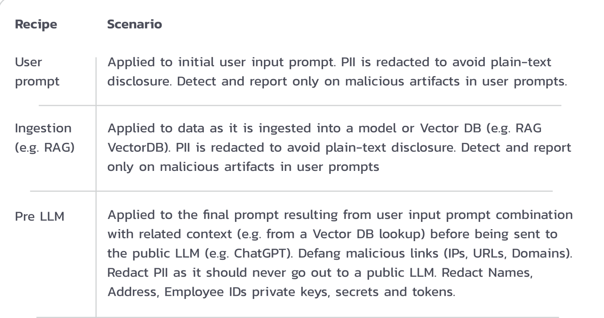
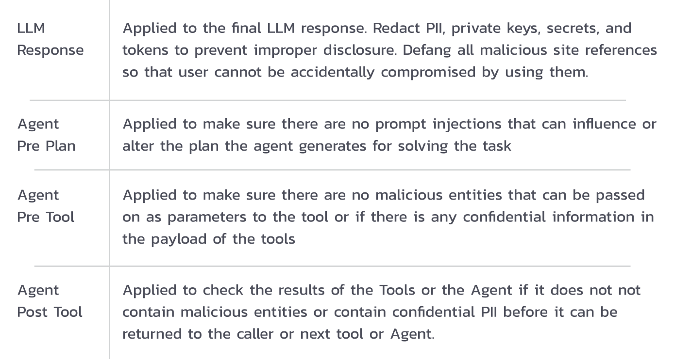
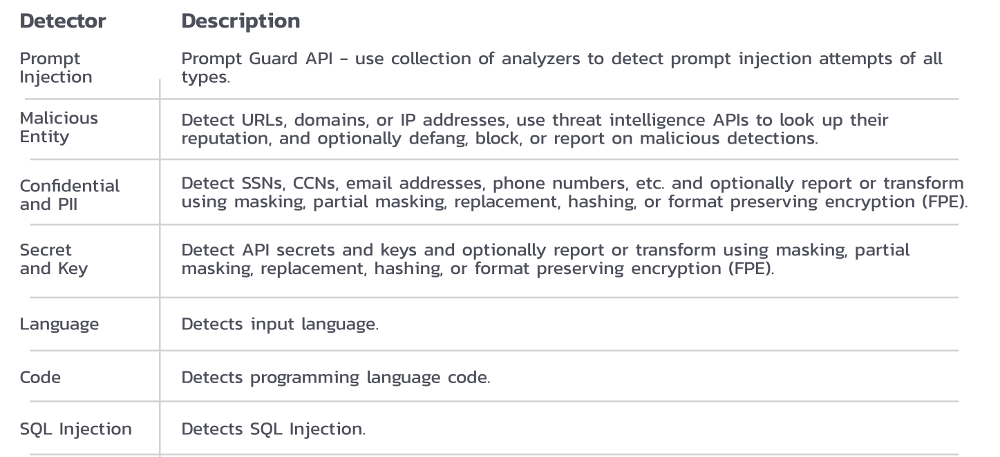
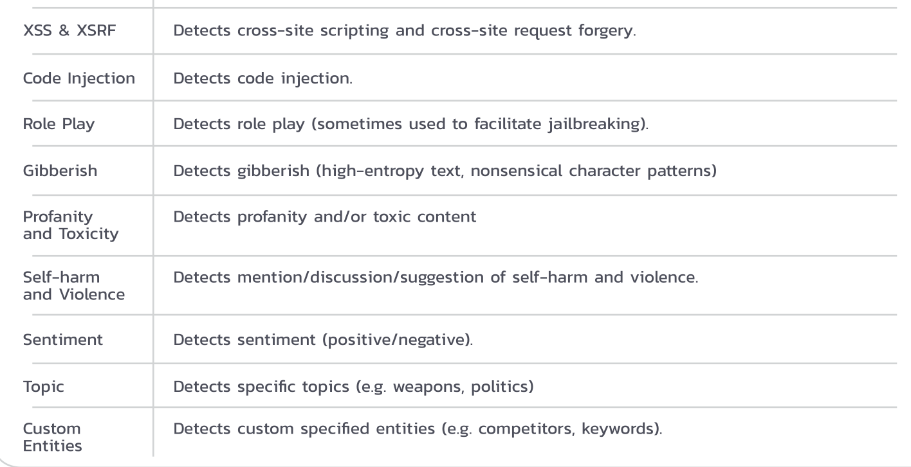

# Protection Cookbook

---

## First pinch of advice

1. Prompt Guard for prompt injection detection
2. Redact for sensitive information detection and transformation
3. Secure Audit Log for sensitive information access tracking
4. Sanitize to protect against malicious links
5. Threat Intelligence to detect malicious entities

Notes:

* Source: [Pangea](https://pangea.cloud/services/ai-guard/)

---

## Recipe book 2

---

## Recipe book 3

---

## Protectors 1

---

## Protectors 2

---

